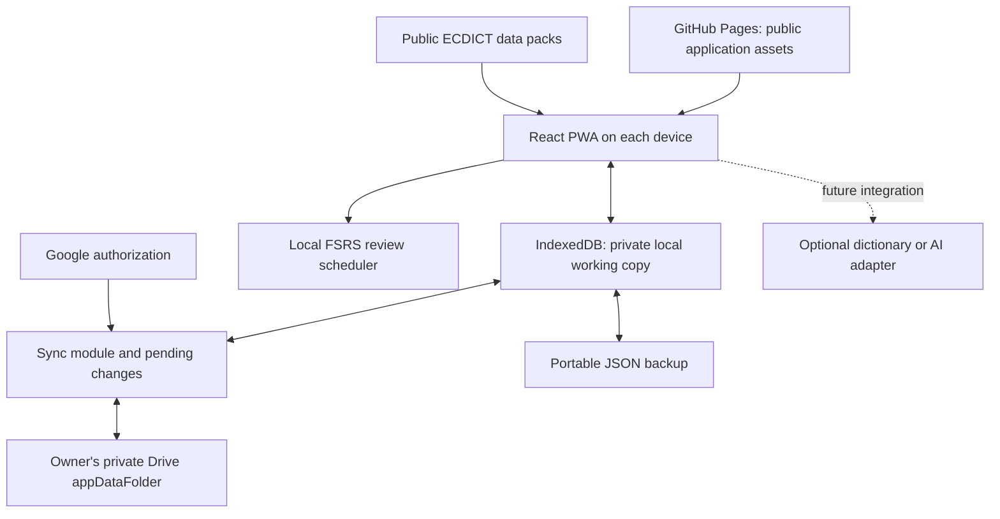

# MyLexicon — final recommended framework

Status: application scaffold implemented on 28 September 2026; no deployment or Google account connection has been created. Dictionary integration is intentionally deferred at the owner’s request. The remaining sections describe the complete target design, including later dictionary work.
Updated: 28 September 2026. Provider terms and quotas were checked during design and must be rechecked when enabling a service.

## 1. Decision and boundaries

Build a personal English–Chinese learning PWA using **React + TypeScript + Vite**, hosted on **GitHub Pages**, with **IndexedDB** for immediate local saves, a packaged **ECDICT** dictionary for basic lookup, **Google Drive** for private cross-device synchronization, and **JSON** for portable backups. Use **ts-fsrs** for review scheduling. All core modules are designed to operate without a subscription or paid API.

One deployment serves one owner. Someone adopting the project supplies their own GitHub deployment, Google OAuth configuration, and Drive storage. AI and browser extensions remain optional additions. No application server, PostgreSQL service, or shared customer account system is needed for the first release.

Three boundaries define what this design actually delivers:

- **The interface is public; the personal library is private.** Ordinary free GitHub Pages cannot restrict delivery of the application to its owner. A stranger can load or copy its interface and use its public dictionary, but receives no access to the owner's private Drive files. Strictly private delivery of the entire website would require changing the hosting/access architecture. This is an explicit tradeoff, not a preference already confirmed by the owner. [GitHub Pages visibility](https://docs.github.com/en/enterprise-cloud@latest/pages/getting-started-with-github-pages/changing-the-visibility-of-your-github-pages-site)
- **Basic lookup is free; unrestricted contextual teaching is not promised.** The first release can look up supported dictionary entries and store words, phrases, sentences, and personal explanations. It will not automatically explain every nuance or rewrite arbitrary sentences without a capable provider.
- **Cross-device sync is included, subject to Google access and reconnection.** Offline edits remain local until synchronization succeeds. JSON import/export is a backup and migration feature, not a substitute for this requirement.

Assumptions: a modest personal text collection, trusted personal devices, and usable GitHub/Google access on the owner's actual networks. Regional reachability, target browser behavior, and dictionary quality still require implementation-time validation.

## 2. Modules and cost

| Responsibility | Selected implementation | Cost and practical boundary |
|---|---|---|
| Interface | React + TypeScript + Vite; components, hooks, and ordinary CSS | Open-source tooling; runs in the browser |
| Hosting | Public GitHub repository, Pages, standard Actions deployment, free github.io address | GitHub Free supports Pages from public repositories; published hosting limits apply |
| Installation/offline use | PWA manifest and service worker | No app-store account; browser support varies |
| Local storage | IndexedDB behind a small storage module | Browser storage, no hosted database bill |
| Basic English–Chinese lookup | Versioned, compact ECDICT data packs | Packaged open data, no per-query API bill |
| Review | ts-fsrs scheduler running locally | Open-source library, no remote scheduling service |
| Cloud authorization | Google Identity Services browser token flow | Personal OAuth setup; periodic reconnection |
| Cross-device data | Google Drive appDataFolder, JSON revision batches | Uses the owner's available Drive storage and standard API allowance |
| Recovery | Dated snapshots and downloadable JSON exports | No additional service |
| AI and commercial providers | Interfaces reserved; disabled initially | No AI consumption or API credential required by the core |

GitHub documents free Pages hosting from public repositories and free standard Actions runner usage for Pages/public repositories. Use a standard runner, short artifact retention, and included storage allowances; do not enable paid cache expansion or larger runners. A custom domain is unnecessary. [Pages overview](https://docs.github.com/en/pages/getting-started-with-github-pages/what-is-github-pages), [Actions billing](https://docs.github.com/en/billing/concepts/product-billing/github-actions), [Pages limits](https://docs.github.com/en/pages/getting-started-with-github-pages/github-pages-limits), [Vite deployment](https://vite.dev/guide/static-deploy)

Google currently describes standard Drive API usage as having no additional cost within its allowances, and has announced future overage billing details for later in 2026. Design for modest usage, bounded retries, and no paid quota upgrades; do not promise unlimited or permanently unchanged free service. If a free limit is reached, preserve local edits and pause cloud work. [Drive limits and pricing](https://developers.google.com/workspace/drive/api/guides/limits)

## 3. Architecture



React manages interactive screens. PWA capabilities provide installation and caching. IndexedDB stores structured records. JSON is the exchange format. These are complementary choices; none automatically implements authentication, synchronization, or encryption.

Application code and public dictionary data go to GitHub Pages. Personal entries, notes, review history, and backups never go into the repository or deployment artifact. The phone and laptop run the same app but maintain separate local copies connected to the same owner's Drive application data.

## 4. Product experience

Use three main views, with settings accessible separately:

| View | Behavior |
|---|---|
| **Lookup** | One input for a word, phrase, or sentence; search personal notes first, then the local dictionary; edit and save the result |
| **Library** | Search English/Chinese text, inspect past lookups, edit notes, filter tags, and select material to practise |
| **Review** | Show due prompts, hide answers until recall is attempted, then record Again/Hard/Good/Easy |

Settings contains Google connection and sync status, dictionary downloads, import/export, backup restoration, and optional provider configuration. Keep routine learning screens focused on the language.

### Lookup and capture

1. Type or paste an expression; optionally include its source sentence and URL.
2. Show prior saved senses, then available dictionary suggestions inside the app.
3. Save the submitted lookup to history by default, with Undo and a do-not-save option. Never save incomplete keystrokes or send them to external services unnecessarily.
4. Let the user select a sense, correct its Chinese meaning, and add context or examples.
5. **Practise this** adds a focused prompt to the review queue. History need not all become review material.

Fields support meaning in Chinese, an English definition, usage pattern, examples, register (formal/casual/technical), suitable settings (conversation/email/academic writing), tone/connotation, tags, and personal notes. Optional fields stay empty when their meaning is unknown. The application must not invent contextual or emotional labels from a basic dictionary record.

For phrases and sentences missing from the dictionary, offer a useful manual card and preserve the input. Saving and practising such material works in the first release; automatic sentence interpretation and rewriting are future capabilities.

### Review

Use recognition from context, Chinese-to-English recall, and user-created gap or sentence-pattern prompts. Start with one prompt per chosen item and a small adjustable daily queue. Show the saved wording and explanation after an attempt, then let the user assess recall. Accept that multiple sentences may express the same idea; there is no rigid exact-match grading.

Use the open-source [ts-fsrs scheduler](https://github.com/open-spaced-repetition/ts-fsrs), pin its version, and retain review events so schedule changes are traceable. Reading a lookup is not recorded as successful recall. Parameter optimization and remote training are outside the first release.

### Access on devices

Provide a responsive web interface, keyboard access, readable contrast, and an optional home-screen installation. Cache the application and explicitly downloaded dictionary packs. Cached personal material and review work offline after initial setup. Installability and mobile share support must be tested on the actual devices. [PWA overview](https://developer.mozilla.org/en-US/docs/Web/Progressive_web_apps/Guides/What_is_a_progressive_web_app)

Begin with paste/type and a home-screen shortcut. A later extension can provide “Look up selected text” and send the selection and source URL into the same PWA. It should not own a separate database. Mobile sharing is a later device-specific enhancement, not a promised universal PWA capability.

## 5. Free dictionary strategy

Use [ECDICT](https://github.com/skywind3000/ECDICT) as the initial English–Chinese data source. Its published schema includes Chinese translations, English definitions, phonetics, part of speech, and inflections, although fields may be missing. The project publishes an [MIT license](https://github.com/skywind3000/ECDICT/blob/master/LICENSE). Its current schema does not establish a complete example-sentence or recorded-audio collection.

Pin a source revision and produce a compact common-word pack plus optional additional packs. Record provenance and retain the applicable license notices. Review the selected data's provenance and sample quality before release. Load packs separately from the interface, display their download size, and allow removal; do not force the entire upstream dataset onto a phone at startup. A missing pack is distinguishable from a missing dictionary entry.

Keep this read-only dictionary separate from the owner's editable collection. Store selected definitions with source/version metadata and allow correction. Dictionary packs belong in the public app assets; personal annotations belong in private storage.

This delivers basic in-app bilingual lookup without a hosted dictionary API, query quota, or private key. Coverage and nuanced explanations will not equal every commercial learner dictionary. Offline lookup requires the relevant pack to have been downloaded and retained.

An optional [Free Dictionary API](https://dictionaryapi.dev/) adapter may supplement English definitions when online. It is not a dependency of saving, Chinese lookup, or review; confirm retention/attribution conditions before storing its results.

### Cambridge, Longman, Youdao, and DeepL

| Source | Decision for this project |
|---|---|
| Cambridge | Reserve an adapter. Official API access requires an arrangement with Cambridge; do not assume a free account or reusable dictionary content. [Official API](https://dictionary-api.cambridge.org/api/) |
| Longman | A supported current public API was not verified during research. Retain source links; do not promise an integrated connector. |
| Youdao | Its dictionary API requires contacting the provider and documents restrictions on caching/reuse. It cannot be the default source for permanently saved review definitions under those published terms. [Official documentation](https://ai.youdao.com/DOCSIRMA/html/dictionary/api/ydcd/index.html) |
| DeepL | Optional future translation provider. Its current plans do not establish a renewable free allowance for every new account, and direct browser API calls are unsupported. [Plans](https://support.deepl.com/hc/en-us/articles/360021200939-DeepL-API-plans), [API restrictions](https://support.deepl.com/hc/en-us/articles/9773914250012-About-DeepL-API) |

Supported provider results can appear inside the app. A link to a provider website is only a reference fallback and may leave the app. Embedding entire websites is subject to their embedding policies and does not supply a dependable data interface. The design does not depend on scraping or bypassing those restrictions.

Only persist content whose source permits retention, including in browser caches, Drive, exports, and review cards. User-authored notes and a source link remain distinct from copying a provider's complete entry.

## 6. Private cloud sync and access

### Selected storage and authorization

Use Drive's hidden **appDataFolder** with the narrow `drive.appdata` scope, not general access to the owner's documents. This storage is specific to the authorized application/user, hidden from normal Drive browsing, and cannot be shared. Users can still delete it or remove the application, so it is not the sole backup. [Drive application data](https://developers.google.com/workspace/drive/api/guides/appdata)

Connect directly from the browser using Google Identity Services' token model. The OAuth client ID is public configuration; it grants no file access by itself. Keep short-lived access tokens only in memory, outside persisted notes, logs, exports, and public assets. No browser client secret or application backend is required. [Google browser token model](https://developers.google.com/identity/oauth2/web/guides/use-token-model)

**Default personal setup:** an External OAuth app in Testing, with only the owner listed as a test user. This restricts who can authorize Drive scopes through this OAuth project. Google documents seven-day consent expiry in Testing when scopes extend beyond basic identity; Drive access therefore needs renewed consent. The app also needs to recover from ordinary short-lived token expiry. [Google OAuth audience](https://support.google.com/cloud/answer/15549945?hl=en)

Show **Connect/Reconnect**, **Saved on this device**, **Syncing**, **Synced at…**, and **Needs attention**. Sync while open, authorized, and online; keep the local app usable when cloud authorization expires. Do not promise permanent login or continuous background synchronization after the app closes.

Publishing the OAuth app in Production can change the consent experience, but also allows an external audience to authorize its own data through that project. It is not an equivalent owner-only audience setting and is not the selected default.

### What prevents access or modification

| Concern | Boundary |
|---|---|
| Someone visits the URL | They can download the public interface and public dictionary; no owner library is included |
| Someone tries to read or edit the cloud lexicon | Google enforces authorization to the owner's private Drive data |
| Someone bypasses React's login screen | This does not give them the owner's access token or Drive permissions |
| Someone tries to spend AI credits | The first release contains no private AI key or paid provider connection |
| Someone tries to change the published code | GitHub repository and deployment permissions control publishing |
| Someone uses an unlocked personal device | Cached data relies on device/browser protection; an interface lock is not encryption |

A stranger can still consume public hosting bandwidth; this architecture cannot guarantee zero public-resource usage. Restrict cloud authorization through the selected OAuth audience rather than claiming a public client ID is a secret.

Only use trusted deployment code and dependencies; malicious code delivered to the owner could act with browser authorization. Render notes and dictionary content as text, not arbitrary executable HTML. Other Pages projects on the same `username.github.io` origin share a browser security boundary and must also be trusted.

Use account-bound local storage namespaces and never upload one account's cached content to another account. Sign-out clears tokens and hides the normal library view; offer removal of cached data, with unsynced edits preserved/exported first. Offline access on an already configured trusted device remains available.

Default data storage is private but not application-level end-to-end encryption. Optional client-side encryption is a separate future feature requiring a recovery design; it is not necessary for an ordinary vocabulary collection and cannot protect unlocked data from compromised app code.

### Synchronization integrity

Google Drive provides authorized file storage; MyLexicon must implement the synchronization logic.

1. Save each edit and its pending sync record in one IndexedDB transaction before showing success.
2. Assign stable entry IDs, unique operation IDs, a device ID, base revisions, and explicit deletion markers. Timestamps alone do not establish which concurrent edit should win.
3. Upload uniquely identified, immutable JSON change batches. Batch saves rather than producing a file per keystroke. Never blindly overwrite a single shared `library.json` with a whole device's stale copy.
4. Download unseen batches, validate their schema, and deduplicate operations, including retries after an uncertain upload response. Support pagination and interrupted transfers.
5. Merge changes to different entries. For simultaneous edits to the same entry, preserve both versions and ask the owner to resolve the conflict. Preserve edit-versus-delete conflicts too.
6. Keep review attempts as uniquely identified events. Rebuild derived schedule state with a documented stable order and pinned scheduler settings; surface conflicting concurrent review histories rather than dropping an attempt silently.
7. Acknowledge uploaded changes individually. New edits arriving during a sync stay pending. Use bounded backoff and allow manual retry.

Keep dated snapshots for recovery and faster initialization; record which operation IDs each snapshot includes. Treat snapshots as rebuildable views of durable changes. Initially retain sync history and deletion markers rather than implementing risky automatic compaction. Add cleanup only with tested rules for old/offline devices. This avoids a CRDT framework while still protecting simultaneous edits.

## 7. Data model and backup

Use JSON-compatible entry objects in IndexedDB, with separate stores for entries, review events, pending operations, and sync metadata. Start with English/Chinese substring search. Different senses of the same expression may have different IDs; do not deduplicate solely by spelling.

Illustrative authored entry, not a complete export or a dictionary quotation:

```json
{
  "id": "a80bf64f-e8c8-46a7-a0ae-196ab475a538",
  "kind": "phrase",
  "text": "put off",
  "meaningZh": "推迟",
  "definitionEn": "Delay something until a later time.",
  "context": "We put off the meeting until Friday.",
  "usage": "put off + noun / doing something",
  "register": "neutral",
  "toneNotes": "这里是在说明改期；实际语气仍取决于上下文。",
  "settings": ["conversation", "work email"],
  "examples": [],
  "tags": ["work"],
  "notes": "",
  "sources": [{ "type": "personal", "label": "My example" }],
  "practiceEnabled": true,
  "createdAt": "2026-09-27T00:00:00Z",
  "updatedAt": "2026-09-27T00:00:00Z",
  "deletedAt": null
}
```

An export envelope contains `schemaVersion`, export time, entries, review events/settings, and unresolved conflicts. Validate types and versions before import; migrate known older formats explicitly. Credentials, OAuth tokens, and downloaded public dictionary packs are excluded. Device-specific sync bookkeeping is rebuilt during import; an import generates explicit changes rather than pretending to be a fresh cloud download.

Provide **Export JSON**, validated **Import**, and **Restore snapshot**. Preview import merge/replacement behavior and make a backup before applying replacements. Keep independent downloaded backups as well as private cloud snapshots: synchronized deletion and account loss can defeat cloud-only recovery.

Request persistent browser storage when supported, but do not promise browser data cannot be evicted or cleared. Show storage/sync problems visibly, and never overwrite a valid local collection with malformed downloads. [Browser storage and eviction](https://developer.mozilla.org/en-US/docs/Web/API/Storage_API/Storage_quotas_and_eviction_criteria)

## 8. Future AI boundary

Reserve small capability interfaces: `lookup`, `translate`, `explainInContext`, and `rewrite`. Keep provider formats outside the entry schema. No plugin marketplace, vector database, agent framework, or live AI service is needed to reserve these interfaces.

A later Explain feature can use a source sentence to discuss Chinese meaning, register, tone, collocations, and alternatives. A later Express feature can accept a Chinese intention or English draft plus audience/tone, then return suggested wording and a short Chinese explanation. Preserve the user's input and label generated text as suggestions.

Enable a provider only after confirming cost, access, browser compatibility, and permitted content retention. Send only the text needed for the explicit request; do not automatically upload the entire lexicon. Local or free-tier AI could be explored, but quality, hardware, quotas, and cross-device availability have not been established.

If an API requires private credentials, add a small owner-authenticated server function at that time. Keep credentials in server secrets. Validate the signed identity token, issuer, audience, expiry, and one configured owner account ID on every protected request; UI checks or CORS alone are insufficient. The default remains AI-disabled until a suitable free arrangement is verified. [Google ID token verification](https://developers.google.com/identity/gsi/web/guides/verify-google-id-token)

## 9. Implementation and setup

Use a single repository with a small module structure:

```text
src/
  views/          lookup, library, review, settings
  domain/         entry schema, validation, review rules
  storage/        IndexedDB transactions and import/export
  dictionary/     local data lookup and provider interface
  sync/           Google authorization, Drive files, conflict handling
  review/         FSRS adapter and event handling
public/
  dictionaries/   generated packs and license notices
scripts/          reproducible dictionary preparation
.github/workflows/ deploy and checks
```

Configure Vite's Pages base path consistently for assets, manifest, and service worker. Use hash navigation for the few views. Cache application assets and permitted dictionary packs; keep private API responses out of generic service-worker caches. Introduce updates without discarding pending edits or making older data unreadable.

Implementation order:

1. **Prove deployment and sync access:** a minimal Pages build, the owner's Google authorization, an appDataFolder round trip from phone and laptop, and reconnection. This validates the principal external dependency before extensive interface work.
2. **Build the learning loop:** local dictionary lookup, add/edit/search, contextual fields, review, persistence, and versioned export/import.
3. **Complete private synchronization:** pending changes, immutable batches, conflicts, deletions, snapshots, and recovery. Cross-device sync is required for the first complete release.
4. **Finish mobile/offline behavior:** dictionary downloads, installation, keyboard/accessibility checks, reliable update handling, clear save/sync states.
5. **Only then consider optional additions:** selected-text extension, device sharing, supported commercial providers, or a verified free AI option.

The eventual self-hosting guide should require only two accounts, GitHub and Google:

1. Copy/fork the public project and enable its Pages deployment.
2. Create a Google Cloud project, enable Drive API, configure an External OAuth app in Testing, and list only the owner.
3. Create a web OAuth client for the exact deployed origin and any intentional development origin. Set its public client ID in app configuration. Never publish credentials or a personal data export.
4. Open the app on each device, connect the same Google account, and download the desired dictionary packs.
5. Verify synchronization and make an independent JSON export. Maintain occasional reconnection and software updates.

Google authorization/setup remains a one-time technical hurdle plus recurring reconnection; free does not mean configuration-free. If either GitHub or Google is unreachable on the required networks, this hosted combination cannot deliver convenient online sync there. The saved offline library remains useful, but a different reachable sync adapter would be required to meet the original cross-device requirement.

## 10. Acceptance criteria

Before calling the first release complete, verify:

- **Learning:** a supported word shows a Chinese meaning inside the app; unsupported phrases/sentences can still be saved with notes; due reviews work and retain their history.
- **Persistence/offline:** saved content survives reload and works without network; downloaded dictionary packs are available; missing data is reported accurately.
- **Two-device correctness:** phone/laptop additions, simultaneous edits, edit/delete conflicts, retries, duplicate requests, and edits made during sync preserve information and converge after conflict resolution.
- **Recovery:** revoked/expired authorization preserves pending edits; export/import and snapshot restoration recover a sample collection; invalid data cannot overwrite it; stale devices do not resurrect deletions.
- **Privacy:** a clean anonymous browser receives no owner data; another Google account cannot authorize Drive access through the owner-only test audience or access the owner's files directly. Removing UI checks does not bypass Google authorization.
- **Account/device handling:** sign-out hides entries and clears tokens; account changes never mix libraries; clearing a device handles unsynced work explicitly.
- **Deployment:** the app works at its actual Pages subpath; updates retain data; published assets contain no personal lexicon or private credentials.
- **Cost/access:** the complete learning loop needs no paid API, AI provider, custom domain, or backend subscription; the owner's actual browsers and networks pass the connection test.

These are proposed acceptance checks, not tests already run. The framework is selected; implementation and device validation remain to be done.
